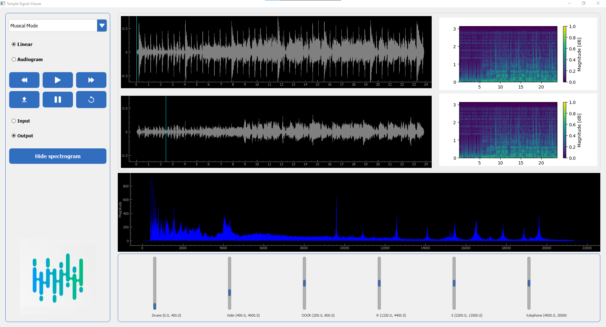

# Signal Equalizer

## Project Overview



Signal Equalizer is a Python project designed to process and analyze various types of signal data, including ECG data. The project includes scripts for reading, processing, and visualizing signal data from different sources.

## Functionalities

- Reading and processing WAV and CSV files.
- Visualizing signal data with interactive plots.
- Applying Wiener filters for signal enhancement.
- Generating and displaying spectrograms.
- Handling different modes for signal analysis, including Uniform Mode, Musical Mode, Animal Song Mode, and ECG Abnormalities Mode.
- Adding and controlling sliders for frequency range adjustments.
- Playing, pausing, and navigating through audio signals.

## Technologies Used

- Python
- PyQt5 for the graphical user interface
- NumPy for numerical operations
- SciPy for signal processing
- Matplotlib for plotting
- PyQtGraph for interactive plots
- SoundFile for reading and writing audio files

## Installation

1. Clone the repository:
   ```sh
   git clone https://github.com/ahmed-226/Signal_Equalizer.git
   ```

2. Navigate to the project directory:
   ```sh
   cd Signal_Equalizer
   ```

3. Install the required dependencies:
   ```sh
   pip install -r requirements.txt
   ```

## Usage

To run the main script, use the following command:
```sh
python main.py
```

## License

This project is licensed under the MIT License.